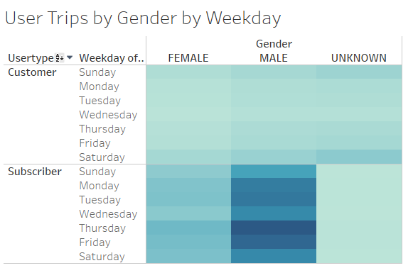

# Bikesharing

## Challenge Overview
### Overview of the NYC Bikesharing Analysis
The purpose of this analysis was to analyze bikesharing data to provide insight into opening a new service in a new city.  Gender metrics, time/day rented, and renter subscriber status were all observed to support the analysis.

## Resources
https://public.tableau.com/app/profile/bekka.ross/viz/Challenge14Story_16492099324530/Story1?publish=yes

## Results

65% of users are male, while 25% are female and the remaining users were not specified.

Primary hours for bike rentals are between 7-9am and 5-7pm - typical times before and after work.

The majority of bikes are rented for less than 20 mins.

The amount of rentals by gender skew heavily toward males, however the distribution of time rented is relatively the same across genders.

Trips are higher during times before/after work, as well as on the weekends.

The same distribution of use by day and time is seen at a gender level - it is just magnified for men, as there are more male users overall.

The majority of users are subscribers, as well as heavily weighted towards males.

## Summary
Based on the results of this analysis, bikesharing should be marketed toward men as well as ensuring availability during peak times of the day as well as on weekends.
